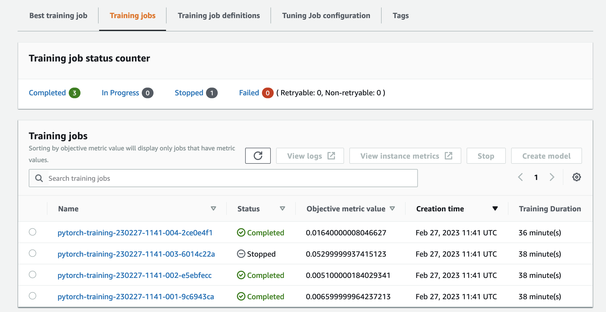
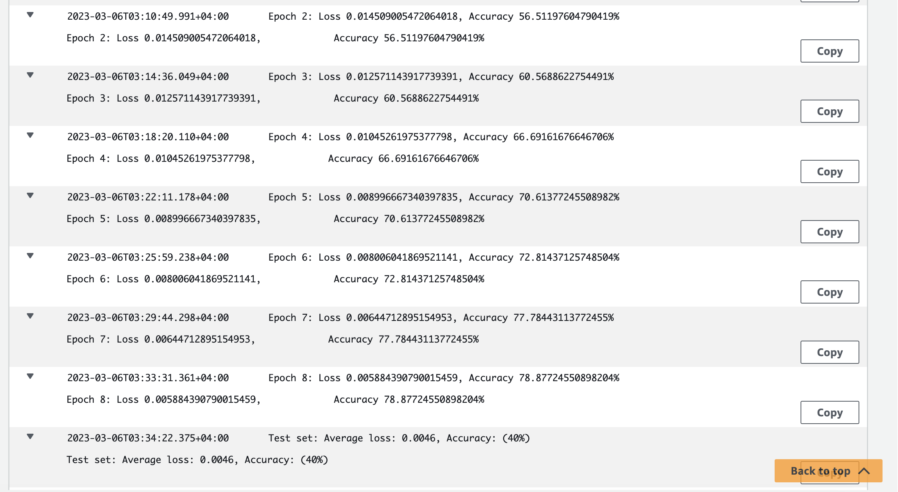
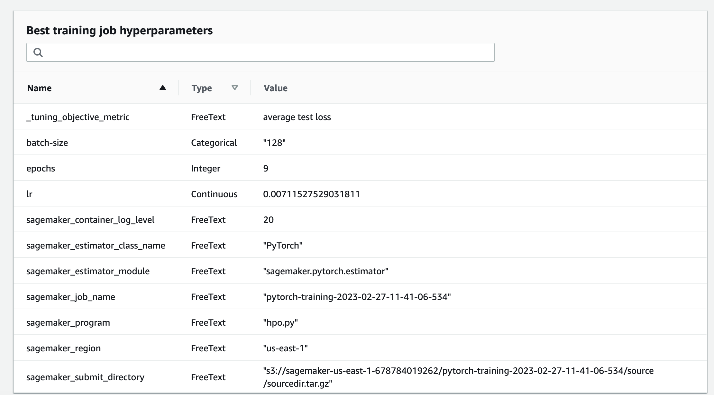
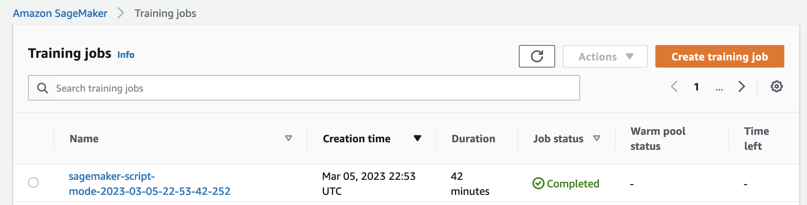
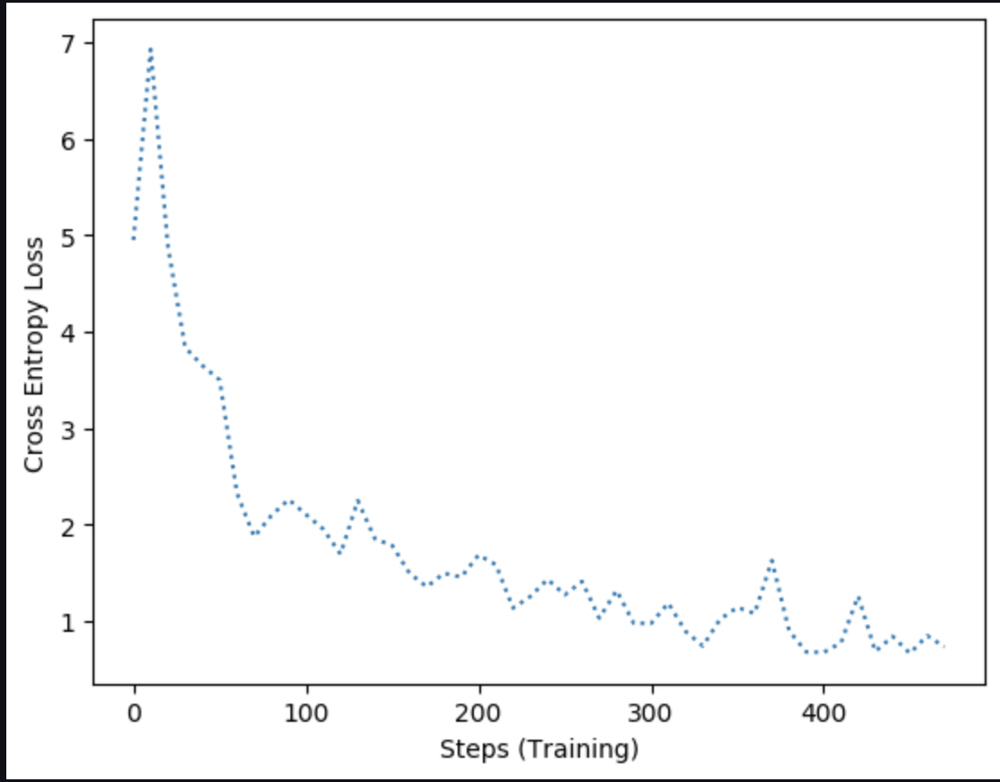
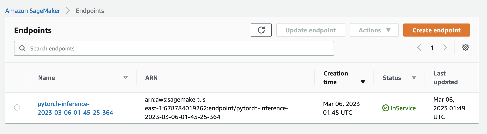

# Image Classification using AWS SageMaker

A pretrained ResNet50 model for image classification is finetuned to identify the dog's breed from the provided Dog's breed dataset.

## Project Set Up and Installation
Enter AWS through the gateway in the course and open SageMaker Studio. 
Download the starter files.
Download/Make the dataset available. 

## Dataset
This project is using the provided dogbreed classification dataset.

### Access
To ensure sagemaker has access to the data, the provided dataset is uploaded to the S3 path at:
s3://sagemaker-us-east-1-678784019262/project-3/data/dog-images

## Hyperparameter Tuning
What kind of model did you choose for this experiment and why? Give an overview of the types of parameters and their ranges used for the hyperparameter search

Since this is a image classification task a pre-trained CNN model: ResNet-50 is chosen for the task. Since the model is trained on over million images from the ImageNet database and is 50 layers deep it seemed the model will require lesser epochs of training to achieve higher accuracy compared to other models. 

The hyperparameter tuning was performed for three parameters i.e. learning rate, batch-size and epochs. The following ranges were provided for each for tuning:

Learning rate - Any value from the continuous range between 0.001 and 0.1
Batch size - One of the values from a list of 3 values i.e. 128, 256 and 512
Epochs - Any integer value in the range from 7 to 10.

The objective of hyperparameter tuning was defined to minimize the average test loss.

A total number of 4 hyperparameter tuning jobs were run with all 4 jobs executed in parallel since the instance used ml.m5.xlarge contains 4 cpu.

The best hyperparameters were identified as below:
Learning rate - 0.007
Batch size - 128
Epochs - 9

Including screenshots below for the hyperparameter tuning explained. 

## Debugging and Profiling
The smedebug module was imported to facilitate debugging and profiling.
In training script, hooks were created and registered. The loss criteria to be tracked was also registered to the hook. The modes were set appropriately based on the stage of execution i.e training or evaluation.

The rules to be monitored were defined using Rule and ProfilerRule and were passed to the training job along with DebuggerHookConfig and ProfilerConfig.

### Results
During debugging the changes in cross entropy loss was traced. There were some undesirable fluctuations in the loss in certain steps. However, the loss seemed to overall reduce with the increase in steps as expected as can be seen in below image:

From profiling report it can be seen that the training consumed close to 40 mins to complete.
It also exposes that a lot of time is spent on inbetween steps whereas the expectation was for it to be spent on training stage. The step outliers as a result seems to have triggered the most. Additional details on this and other rule summary and the recommended strategies to fix the issues can be seen in the attached profiler-report.html document.

The profiler's html report is included in the path "CD0387-deep-learning-topics-within-computer-vision-nlp-project-starter/profilerReport/profiler-report.html"

## Model Deployment
The model data is retrieved from S3 using the following line of code:
`model_data = estimator.output_path + estimator.latest_training_job.job_name + "/output/model.tar.gz"`

Using the retrieved model and the script in inference.py file a PyTorchModel was created and deployed in a single instance of ml.t2.medium. This generated the endpoint with name 'pytorch-inference-2023-03-06-01-45-25-364'.

A custom method called predict is used to make predictions on image using the endpoint. The method accepts the image path, loads the image, transforms the image in the same fashion it was transformed in the training stage, and calls the endpoints inbuilt predict method to get the prediction.

